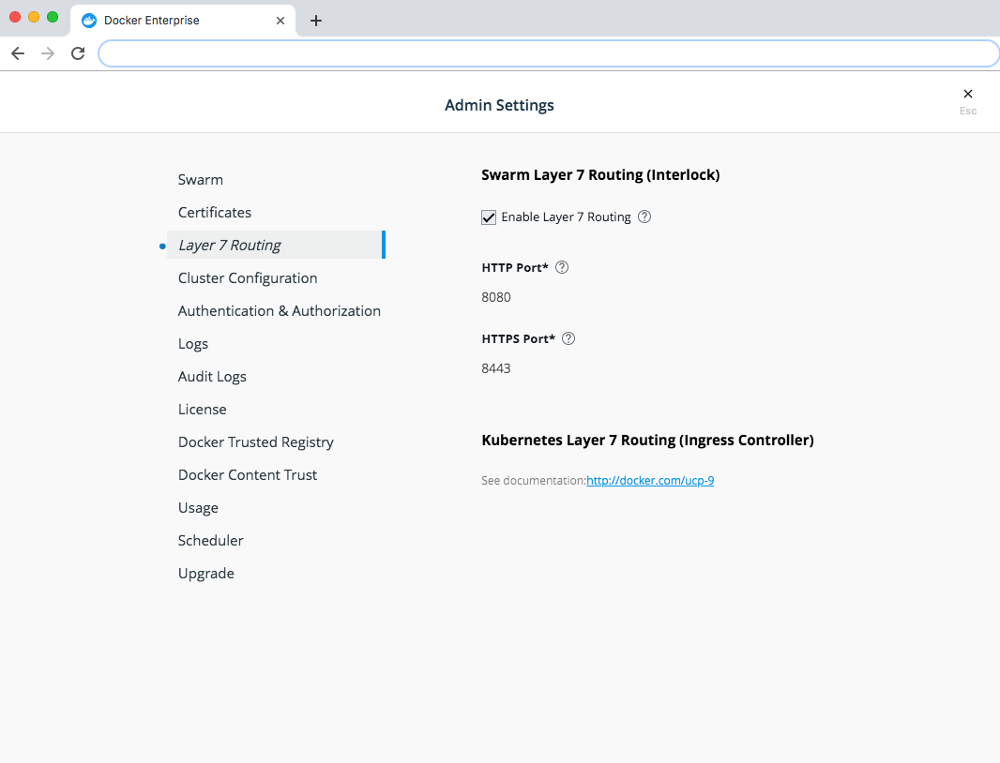

This topic covers deploying a layer 7 routing solution into a Docker Swarm to route traffic to Swarm services. Layer 7 routing is also referred to as an HTTP routing mesh (HRM).

## Prerequisites

- [Docker](https://www.docker.com) version 17.06 or later
- Docker must be running in [Swarm mode](/engine/swarm/)
- Internet access (see [Offline installation](./offline-install.md) for installing without internet access)

## Enable layer 7 routing via UCP

By default, layer 7 routing is disabled, so you must first
enable this service from the UCP web UI.

1. Log in to the UCP web UI as an administrator.
2. Navigate to **Admin Settings**.
3. Select **Layer 7 Routing**.
4. Select the **Enable Layer 7 Routing** check box.

{: .with-border}

By default, the routing mesh service listens on port 8080 for HTTP and port
8443 for HTTPS. Change the ports if you already have services that are using
them.

When layer 7 routing is enabled:

1. UCP creates the `ucp-interlock` overlay network.
2. UCP deploys the `ucp-interlock` service and attaches it both to the Docker
socket and the overlay network that was created. This allows the Interlock
service to use the Docker API. That's also the reason why this service needs to
run on a manger node.
3. The `ucp-interlock` service starts the `ucp-interlock-extension` service
and attaches it to the `ucp-interlock` network. This allows both services
to communicate.
4. The `ucp-interlock-extension` generates a configuration to be used by
the proxy service. By default the proxy service is NGINX, so this service
generates a standard NGINX configuration. UCP creates the `com.docker.ucp.interlock.conf-1` configuration file and uses it to configure all
the internal components of this service. 
5. The `ucp-interlock` service takes the proxy configuration and uses it to
start the `ucp-interlock-proxy` service.

Now you are ready to use the layer 7 routing service with your Swarm workloads. There are three primary Interlock services: core, extension, and proxy. To learn more about these services, see [TOML configuration options](https://docs.docker.com/ee/ucp/interlock/config/#toml-file-configuration-options). 

The following code sample provides a default UCP configuration. This will be created automatically when enabling Interlock as described in this section.

```toml
ListenAddr = ":8080"
DockerURL = "unix:///var/run/docker.sock"
AllowInsecure = false
PollInterval = "3s"

[Extensions]
  [Extensions.default]
    Image = "{{ page.ucp_org }}/ucp-interlock-extension:{{ page.ucp_version }}"
    ServiceName = "ucp-interlock-extension"
    Args = []
    Constraints = ["node.labels.com.docker.ucp.orchestrator.swarm==true", "node.platform.os==linux"]
    ProxyImage = "{{ page.ucp_org }}/ucp-interlock-proxy:{{ page.ucp_version }}"
    ProxyServiceName = "ucp-interlock-proxy"
    ProxyConfigPath = "/etc/nginx/nginx.conf"
    ProxyReplicas = 2
    ProxyStopSignal = "SIGQUIT"
    ProxyStopGracePeriod = "5s"
    ProxyConstraints = ["node.labels.com.docker.ucp.orchestrator.swarm==true", "node.platform.os==linux"]
    PublishMode = "ingress"
    PublishedPort = 8080
    TargetPort = 80
    PublishedSSLPort = 8443
    TargetSSLPort = 443
    [Extensions.default.Labels]
      "com.docker.ucp.InstanceID" = "fewho8k85kyc6iqypvvdh3ntm"
    [Extensions.default.ContainerLabels]
      "com.docker.ucp.InstanceID" = "fewho8k85kyc6iqypvvdh3ntm"
    [Extensions.default.ProxyLabels]
      "com.docker.ucp.InstanceID" = "fewho8k85kyc6iqypvvdh3ntm"
    [Extensions.default.ProxyContainerLabels]
      "com.docker.ucp.InstanceID" = "fewho8k85kyc6iqypvvdh3ntm"
    [Extensions.default.Config]
      Version = ""
      User = "nginx"
      PidPath = "/var/run/proxy.pid"
      MaxConnections = 1024
      ConnectTimeout = 600
      SendTimeout = 600
      ReadTimeout = 600
      IPHash = false
      AdminUser = ""
      AdminPass = ""
      SSLOpts = ""
      SSLDefaultDHParam = 1024
      SSLDefaultDHParamPath = ""
      SSLVerify = "required"
      WorkerProcesses = 1
      RLimitNoFile = 65535
      SSLCiphers = "HIGH:!aNULL:!MD5"
      SSLProtocols = "TLSv1.2"
      AccessLogPath = "/dev/stdout"
      ErrorLogPath = "/dev/stdout"
      MainLogFormat = "'$remote_addr - $remote_user [$time_local] \"$request\" '\n\t\t    '$status $body_bytes_sent \"$http_referer\" '\n\t\t    '\"$http_user_agent\" \"$http_x_forwarded_for\"';"
      TraceLogFormat = "'$remote_addr - $remote_user [$time_local] \"$request\" $status '\n\t\t    '$body_bytes_sent \"$http_referer\" \"$http_user_agent\" '\n\t\t    '\"$http_x_forwarded_for\" $request_id $msec $request_time '\n\t\t    '$upstream_connect_time $upstream_header_time $upstream_response_time';"
      KeepaliveTimeout = "75s"
      ClientMaxBodySize = "32m"
      ClientBodyBufferSize = "8k"
      ClientHeaderBufferSize = "1k"
      LargeClientHeaderBuffers = "4 8k"
      ClientBodyTimeout = "60s"
      UnderscoresInHeaders = false
      HideInfoHeaders = false
```

## Enable layer 7 routing manually

Interlock can also be enabled from the command line, as described in the following sections.

### Work with the core service configuration file

Interlock uses the TOML file for the core service configuration. The following example utilizes Swarm deployment and recovery features by creating a Docker Config object:

```bash
$> cat << EOF | docker config create service.interlock.conf -
ListenAddr = ":8080"
DockerURL = "unix:///var/run/docker.sock"
PollInterval = "3s"

[Extensions]
  [Extensions.default]
    Image = "{{ page.ucp_org }}/ucp-interlock-extension:{{ page.ucp_version }}"
    Args = ["-D"]
    ProxyImage = "{{ page.ucp_org }}/ucp-interlock-proxy:{{ page.ucp_version }}"
    ProxyArgs = []
    ProxyConfigPath = "/etc/nginx/nginx.conf"
    ProxyReplicas = 1
    ProxyStopGracePeriod = "3s"
    ServiceCluster = ""
    PublishMode = "ingress"
    PublishedPort = 8080
    TargetPort = 80
    PublishedSSLPort = 8443
    TargetSSLPort = 443
    [Extensions.default.Config]
      User = "nginx"
      PidPath = "/var/run/proxy.pid"
      WorkerProcesses = 1
      RlimitNoFile = 65535
      MaxConnections = 2048
EOF
oqkvv1asncf6p2axhx41vylgt
```

### Create a dedicated network for Interlock and extensions

Next, create a dedicated network for Interlock and the extensions:

```bash
$> docker network create -d overlay interlock
```

### Create the Interlock service

Now you can create the Interlock service. Note the requirement to constrain to a manager. The
Interlock core service must have access to a Swarm manager, however the extension and proxy services
are recommended to run on workers. See the [Production](./production.md) section for more information
on setting up for a production environment.

```bash
$> docker service create \
    --name interlock \
    --mount src=/var/run/docker.sock,dst=/var/run/docker.sock,type=bind \
    --network interlock \
    --constraint node.role==manager \
    --config src=service.interlock.conf,target=/config.toml \
    {{ page.ucp_org }}/ucp-interlock:{{ page.ucp_version }} -D run -c /config.toml
sjpgq7h621exno6svdnsvpv9z
```

At this point, there should be three (3) services created: one for the Interlock service,
one for the extension service, and one for the proxy service:

```bash
$> docker service ls
ID                  NAME                MODE                REPLICAS            IMAGE                                                       PORTS
lheajcskcbby        modest_raman        replicated          1/1                 nginx:alpine                                                *:80->80/tcp *:443->443/tcp
oxjvqc6gxf91        keen_clarke         replicated          1/1                 {{ page.ucp_org }}/ucp-interlock-extension:{{ page.ucp_version }}
sjpgq7h621ex        interlock           replicated          1/1                 {{ page.ucp_org }}/ucp-interlock:{{ page.ucp_version }}
```

The Interlock traffic layer is now deployed. 

## Next steps

- [Configure Interlock](../config/index.md) 
- [Deploy applications](../usage/index.md)
- [Production deployment information](./production.md)
- [Offline installation](./offline-install.md)
